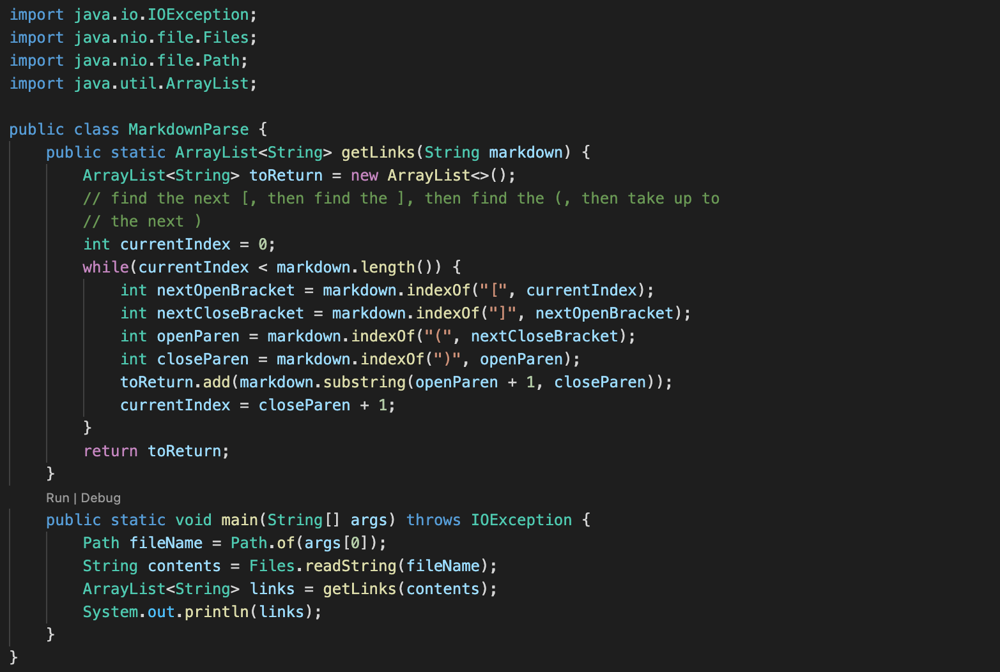
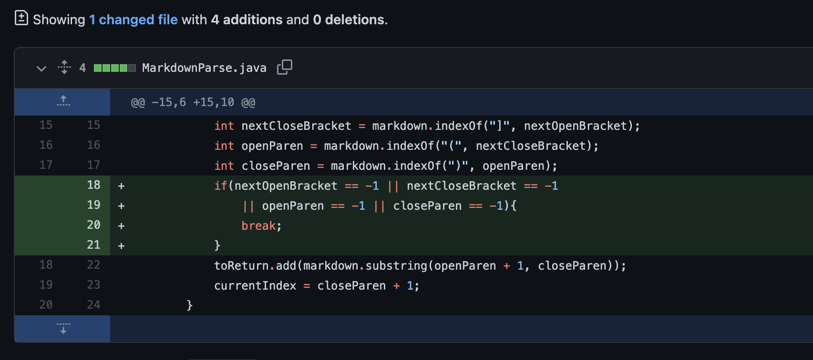
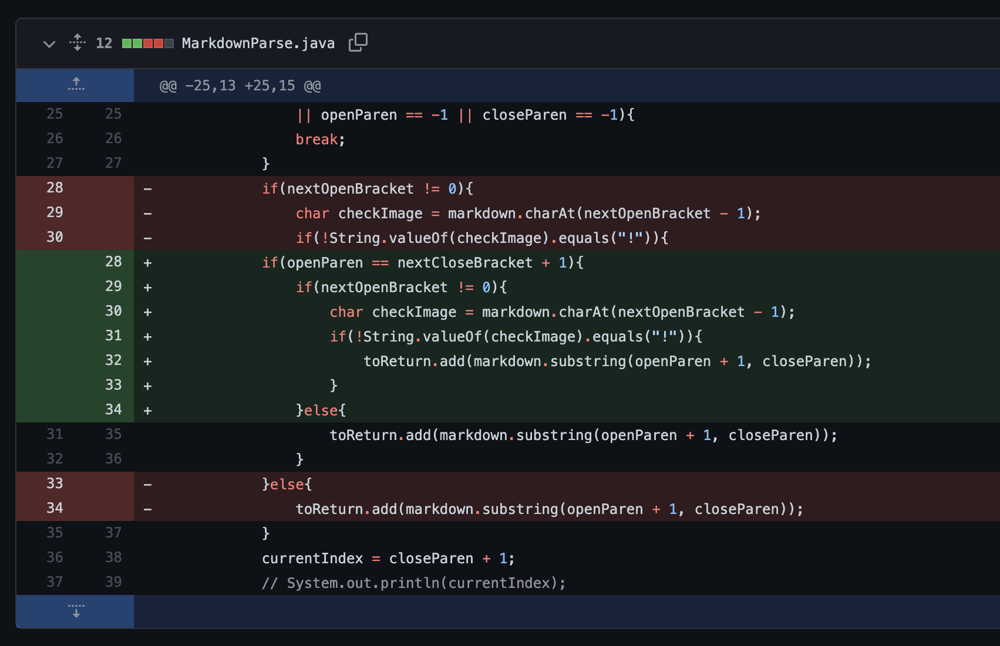

This blog post is my lab report for CSE 15L Week 3-4, 2022 winter at UCSD. The main topic for this lab is testing and debugging, so in this lab report I will describe and reflect on the process of fixing the bug. The sample program used in this week’s lab is a program that print out all the URLs of links in a .md file provided as command line argument.

The provided program has several bugs and I will talk about them one by one.
# Bug 1 - Program is not ended after last URL
I created a new [test1](https://github.com/QijunHuMary/markdown-parse/blob/main/test1.md?plain=1) for the program by adding random characters after the last URL. This ends up giving the symptom:
```
Exception in thread "main" java.lang.OutOfMemoryError: Java heap space
at java.base/java.lang.StringLatin1.newString(StringLatin1.java:769)
at java.base/java.lang.String.substring(String.java:2709)
at MarkdownParse.getLinks(MarkdownParse.java:18)
at MarkdownParse.main(MarkdownParse.java:26)
```
This symptom shows that the program enters an infinite loop, so it doesn’t end successfully after the last URL, leading to a `OutOfMemoryError`. To discover what bug has caused this symptom to happen, I added some print statement to print out `nextOpenBracket`, `nextCloseBracket`, `openParen`, `closeParen`, and also `currentIndex` and `markdown.length()`, which are the direct variables that lead to infinite loop. The values of these variables can help me better understand what is happening to these variables when the program runs and discover where the issue is. I found that the symptom of infinite loop happens because the function `String.indexOf(String, int)` will return `-1` when the specified substring doesn’t occur. In this case, the program needs to stop the loop if any method returns `-1` because that means there’s no URL after that. If the program doesn’t stop and there’s other characters after the last URL, like in the failure-induced test we have, the program will loop again with the false value `-1` stored in the variable, making the program a mess. Therefore, the bug is fixed by adding some check statement:

# Bug 2 - Program output include image
I created the new [test2](https://github.com/QijunHuMary/markdown-parse/blob/main/test2.md?plain=1) file including an image and a link. I added some random characters at the end of this test file to make sure the first bug remain fixed while we change the program to fix the second bug. The symptom is the program printed out `[someImage.png, someLink.html]` instead of the expected output `[someLink.html]`. We can see that the program has the bug of falsely including the image name as well, because we included an image in the failure-induced test file. To fix this bug, I realized the different between image syntax and link syntax is there is a `!` before the image. Therefore, we can fix the bug by adding condition checking:

# Bug 3 - Program output include non-URL
I created the new [test3](https://github.com/QijunHuMary/markdown-parse/blob/main/test3.md?plain=1) file including some random text between `[some random stuff]` and `(random things)` followed by another link `[link](someLink.html)`, so in this case there’s only one true link. The symptom is the program printed out `[random things, someLink.html]` instead of the expected output `[someLink.html]`, including things that is not a URL. Because the program didn’t check whether `[]` and `()` is connected, so the failure-induced test file tripped the program by deliberately asserting text between them, making it not a link but will be recognized falsely by the program. To fixed this bug, we need to ensure the `[]` and `()` is tightly connected. Therefore, we can fix the bug by adding:

# Conclusion
In this lab, I mainly learned about how to test and debug in a more systematic way. Also, I have gained hands-on experience to test and solve the bugs of the matching-URL program.
