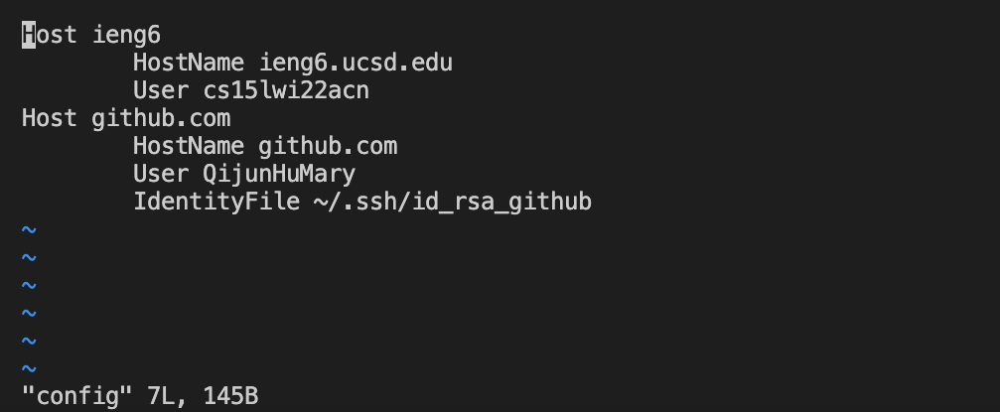
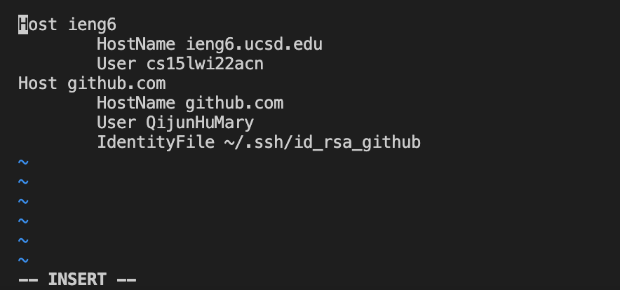
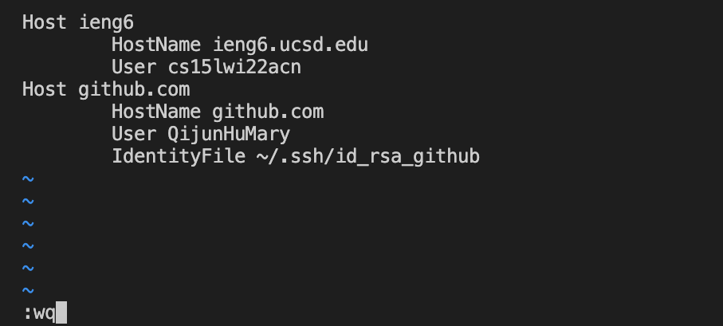
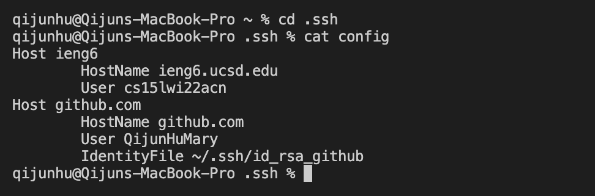
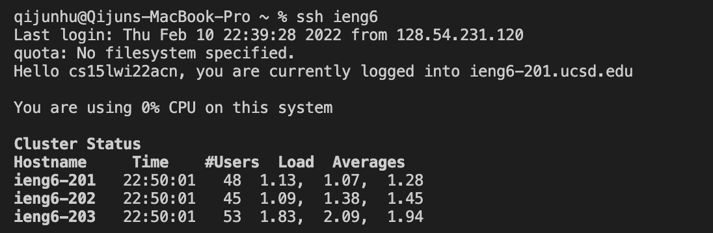
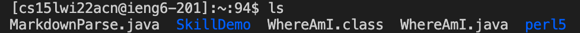

This blog post is my lab report for CSE 15L Week 5, 2022 winter at UCSD. The main topic for this lab is “It Works on My Machine”, so in this lab we mainly tried various methods to make the process of uploading and testing our programs on distance servers more convenient. There are three options for this lab and I have went through all of them, but I will focus on the first option “Streamlining ssh Configuration” in this lab report, which mainly simplifies the process of logging in to the server account.
# Set up the `config` file
Set up the `config` file at the location `~/.ssh/config` and put in specific information can allow logging in to the server account without typing the long user name. Because the folder name is started with `.`, I decided to create and edit the `config` file in the terminal, so I searched online to learn how to do that. The following is the process.
First, use `mkdir .ssh` to create the `.ssh` folder. Inside the folder, use `touch config` to create the empty `config` file. After that, use the command `vi config` to enter the edit status of the file, after pressing enter it will show the content of the file (it should be empty before inserting anything):

Next, press the key “i” on the keyboard to enter the edit page:

After inserting the hostname and username, press the key “esc” to exit edit page and type `:wq` and press enter to save the edit. By the way, to not save the change, input `:q!` and press enter.

To check if we successfully edit the file, we can use `cat config` to print out the current content stored in the file.

# Log in the server
After setting up the `config` file, we can now log into the server with the command `ssh ieng6` and without typing the long user name. The `ieng6` is used in the command because in the last step I set up the `config` file to make the host `ieng6` in the first line.

# Copying files to the server
Now we can use the `scp` to copy files to the server in a shorter way. We can replace the long user name with the name we set (`ieng6`) and input the command `scp MarkdownParse.java ieng6:~/` to copy the file `MarkdownParse.java` to the main directory of the server.

We can check if the file is successfully uploaded by logging in to the server and use `ls` to check all the files inside:

