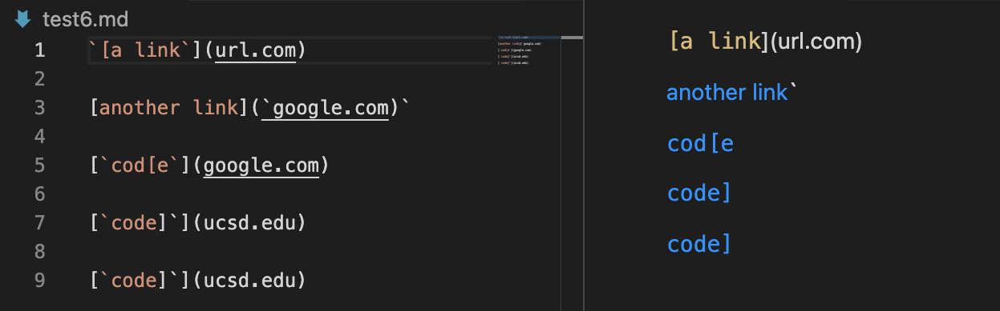
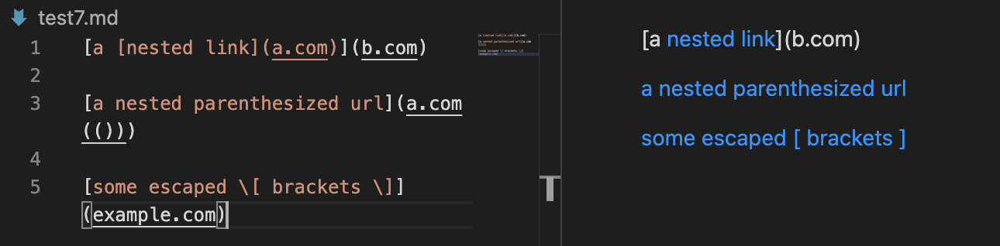
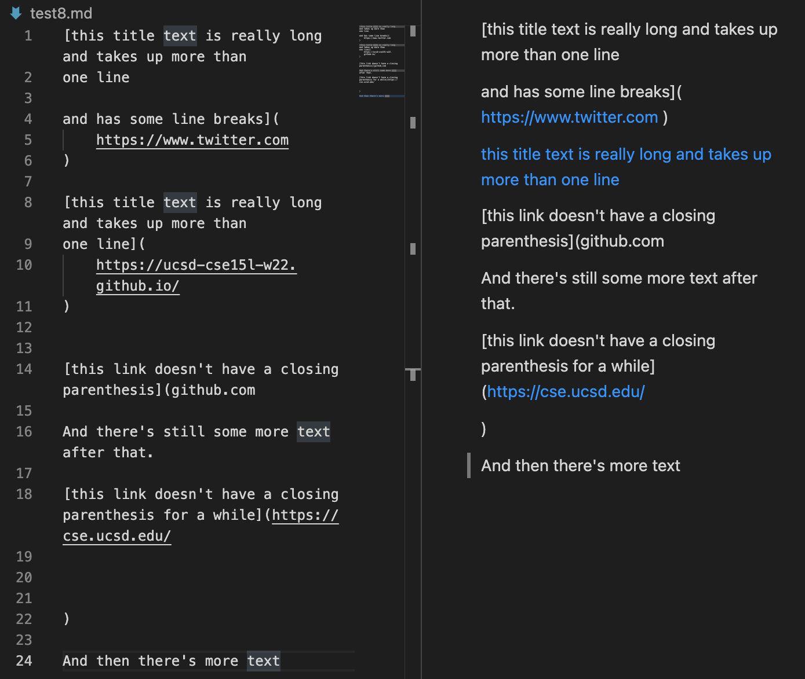
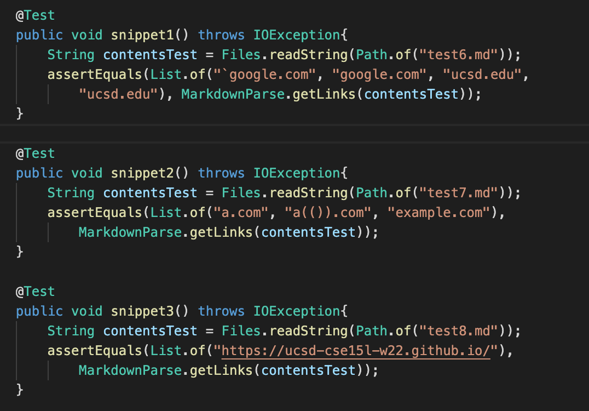
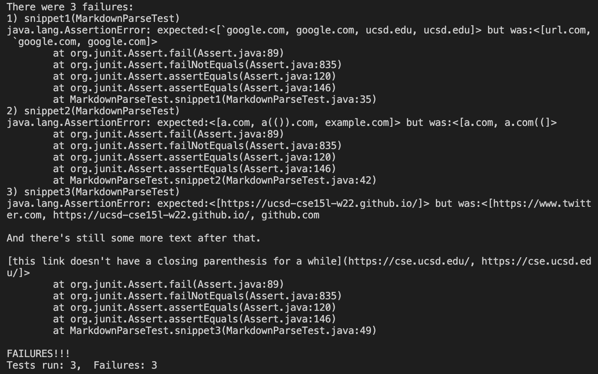
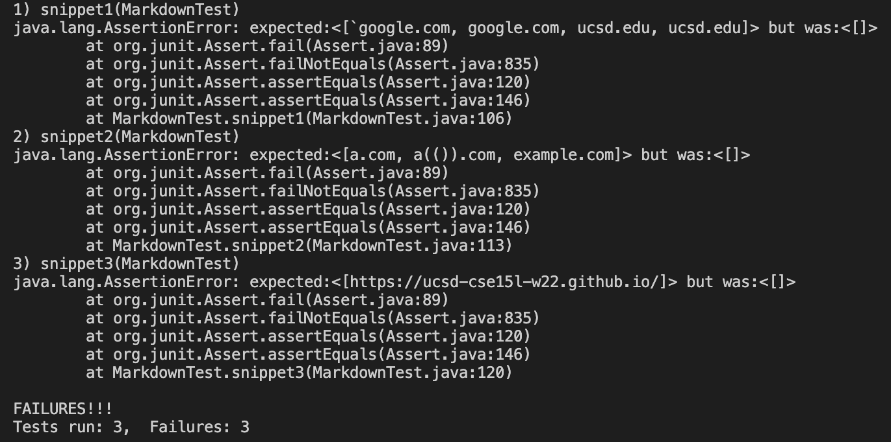

This blog post is my lab report for CSE 15L Week 7, 2022 winter at UCSD. The main topic for this lab is “Code Review”, so in this lab we mainly review the codes to identify bugs and try to think of ways to fix them. In this lab report, I will go through my code and another person’s code with three test cases and then talk about how these symptoms might be solved. Here is the link to my [markdown-parse](https://github.com/QijunHuMary/markdown-parse) repository and the link to another person’s [markdown-parse](https://github.com/yayajjiang/markdown_inperson) repository.
# Testing
By using the VScode preview, I can know what links these snippets should produce. For snippet 1, there should be four links:

For snippet 2, there should be three links:

For snippet 3, there should be one link. Although there’s three “links”, the first one and the third one is blue only because they are real links but they are not actually recognized by the markdown file as a link:

Now I turned these results into tests in `MarkdownParseTest.java` by using JUnit test:

For my own implementation, all three tests failed:

For the implementation I reviewed, all three tests failed:

# Trying to Debug
For snippet 1, my implementation failed because it doesn’t count the impact of the backticks on the links. I believe this could not be solved with a small code change because there’s many possibilities how the backticks can be inserted into the text. I possible way to fix this issue is to break the text according to line breaks because backticks can’t work if there’s line breaks between them and neither can links, so we can view each line as a simpler case to identify links. The condition for a link to work is when the two brackets of that link are not locating between two paired backticks, so we can identify the locations of paired brackets and paired backticks to see whether the link counts.
For snippet 2, my implementation failed because it’s not finding the correct pairing brackets and parenthesis. I believe this could be solved with a relative small code change, maybe not as small as 10 lines but it doesn’t need structural change with the code. We can add a method to find the correct pairing brackets and parenthesis, like the one in week 8 lab, which can solve a great part of this bug. Some other details include when there’s a link between a pairing brackets, then they couldn’t be used for a link, and also the bracket with backslash before it should count when find the correct pairing. Still, we should include line breaks when identifying for correct pair as well because when there’s line breaks between two brackets, they don’t work as a pair anymore.
For snippet 3, my implementation failed because it’s doesn’t consider the line breaks between brackets and parentheses. I believe this could be solved with a small code change by adding the detection of line breaks when searching for bracket pairs and parenthesis pairs. This should fix the problem.
