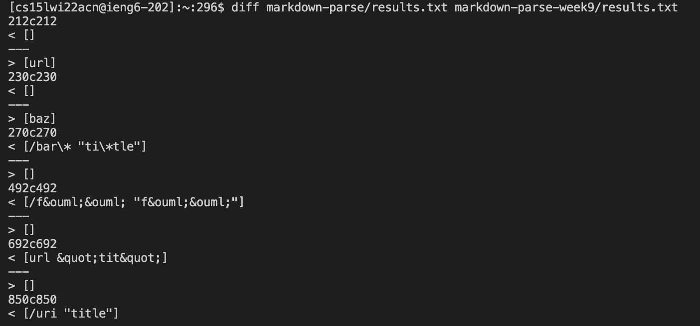
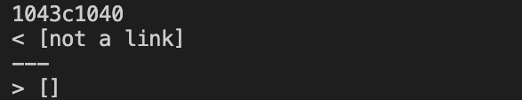
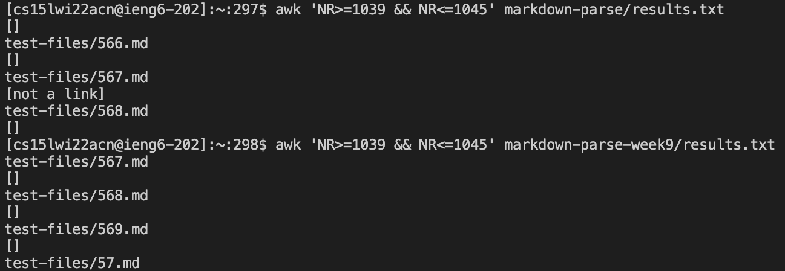
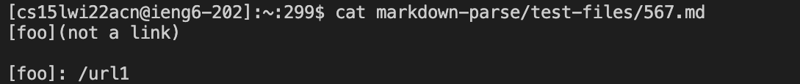
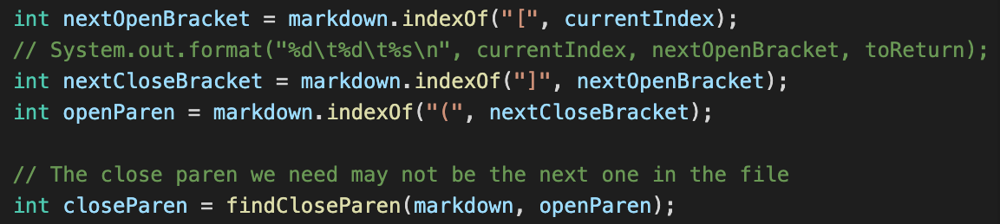
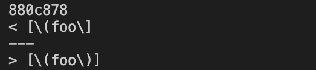
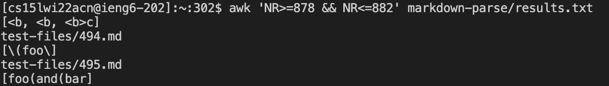
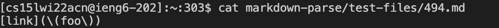
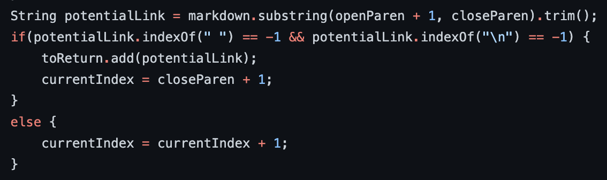

This blog post is my lab report for CSE 15L Week 9, 2022 winter at UCSD. The main topic for this lab is “Using a Script to Run Many Files”, so in this lab we mainly learned the ways to run many tests together in order to save time. In this lab report, I will compare the test results of two different programs, one is my own and the other is the program provided by the professor.
# Compare the results
I used the `diff` command to compare the two test results from two different programs. The results are stored to the `results.txt` in different folders from running the `bash script.sh > results.txt` command. The first several results of `diff` is as shown:

# First different result
The first different result I pick is the one at the 1043 line from my `results.txt` and 1040 line from the `result.txt` of the professor’s program.

I used the `awk` command to print out the results at these lines and found they are from the same `.md` test file.

We can see from the screen shot that this test file that produce different results is the `567.md` file. Now I printed out this file using the `cat` command.

By using the VScode, I found that the correct output for this test file should be `[url1]` and not `[not a link]` produced by my program or `[]` produced by the provided program as shown in the previous picture.
For my program, the bug in the code is that I didn’t consider the situation of reference-style link, where the link is set like a variable at the end of the file. In order to fix this bug, I will need to add a helper method to identify all the reference-style link in the markdown file in the form of `[xxx]:xxx`. I will need to record all the names of the link in order to identify the correct link and also exclude the text that is not a link. In the `getLink` method, after identifying the index of `[` and `]`:

I will need to add the code to verify if the content inside the brackets match with any of the name of the reference-style link, if it matches, then the parenthesis follows should be disregarded.
# Second different result
The first different result I pick is the one at the 880 line from my `results.txt` and 878 line from the `result.txt` of provided program.

I used the `awk` command to print out the results at these lines to find which test file produced this different result:

We can see from the screen shot that this test file that produce different results is the `494.md` file. Now I printed out this file using the `cat` command.

By using the VScode, I found that the correct output for this test file should be `[(foo)]` and not `[\(foo\]` produced by my program or `[\(foo\)]` produced by the provided program as shown in the previous picture.
For the provided program, this bug is caused by including the backslash character when identifying the link. To fix this bug, in this part of the code:

We should add a line of code that remove the backslash character before special characters like parenthesis and brackets.
